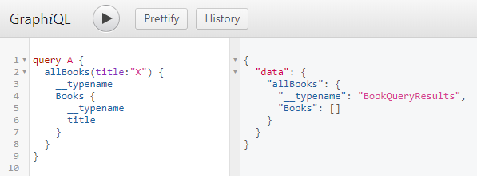

# GraphQL Cache Invalidation

This page describes how other GraphQL libraries handle client-side caching, how those solutions fail at times, and how this library handles it instead.

## Apollo

Apollo parses all of your query and mutation results, and updates the client cache as things change. For example, let's say you run

```javascript
tasks(assignedTo: "Adam") {
  Tasks {
    id, description, assignedTo
  }
}
```

and get back

```javascript
[
  { id: 1, description: "Adam's Task 1", assignedTo: "Adam" },
  { id: 2, description: "Adam's Task 2", , assignedTo: "Adam" }
];
```

Now, if you subsequently run something like

```javascript
mutation {
  updateTask(id: 1, assignedTo: "Bob", description: "Bob's Task")
}
```

Apollo will dutifully modify the orignial query from above to now return

```json
[
  { "id": 1, "description": "Adam's Task 1", "assignedTo": "Adam" },
  { "id": 2, "description": "Adam's Task 2", "assignedTo": "Adam" }
];
```

which is horribly wrong, since task number 1 should no longer be in this result set at all—but Apollo has absolutely no way of knowing this, without re-running the same query. Apollo has escape hatches, of course, for you to manually purge the cache.

## urql

`urql` takes a different approach and, after any mutation, invalidates any and all queries which deal with the data type you just mutated. This is a lot closer in terms of correctness, but even here there are edge cases which GraphQL's limited type introspection make difficult. For example, let's say you run this query



`urql` (last I checked) does not know that this query returned results of the `Book` type, since it has no way of knowing this, since it doesn't know that the `BookQueryResults` contains an array of Books (at least not without a build step). It's also worth noting that there may very well be data which _can_ be updated on the client after mutations, as Apollo does, without requiring new network requests.

No single, automated solution will cover all use cases.

## micro-graphql-react

This library takes a different approach, and doesn't presume to have this problem solved; instead, it provides straightforward helpers you can use to direct how the cache should be updated or cleared after mutations. See the main docs for more info.
